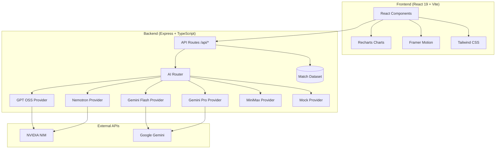

<div align="center">

# ⚽ GoalVision AI

### *Understand Football Like Never Before*

**AI-Powered Explainable Football Match Analysis**

[](https://skillsbuild.org)
[](https://www.typescriptlang.org)
[](https://react.dev)
[](https://tailwindcss.com)
[](https://frontend-kappa-one-vbm676kzvp.vercel.app)
[](https://goalvision-api.onrender.com)

### 🚀 Live Demo

[](https://frontend-kappa-one-vbm676kzvp.vercel.app)

**Frontend:** https://frontend-kappa-one-vbm676kzvp.vercel.app  
**Backend API:** https://goalvision-api.onrender.com

</div>

---

## 📋 Table of Contents

- [Overview](#-overview)
- [Problem Statement](#-problem-statement)
- [Solution](#-solution)
- [Features](#-features)
- [Explainable AI](#-explainable-ai)
- [Multi-Model AI Engine](#-multi-model-ai-engine)
- [Architecture](#-architecture)
- [Tech Stack](#-tech-stack)
- [Installation](#-installation)
- [Running Locally](#-running-locally)
- [Deployment](#-deployment)
- [Folder Structure](#-folder-structure)
- [Future Improvements](#-future-improvements)
- [License](#-license)

---

## 📖 Overview

GoalVision AI transforms raw football match data into **understanding**. Instead of overwhelming fans with numbers or delivering black-box predictions, it **explains the game in plain language** — every insight is grounded in real match data and fully transparent.

The application ships with **three legendary matches**: the 2022 World Cup Final, the Miracle of Istanbul (2005), and Liverpool 4–0 Barcelona (2019).

Built for the **IBM SkillsBuild AI Challenge**, GoalVision features a **Multi-Model AI Engine** with intelligent routing across GPT OSS 120B, Gemini Pro, Gemini Flash, Nemotron Ultra, and MiniMax M3 — with automatic fallback so it never fails.

---

## 🎯 Problem Statement

Football analytics today suffers from two problems:

1. **Black-box predictions** — Fans are told *"Team A has a 72% win probability"* but never *why*. The model is opaque, the reasoning invisible.
2. **Information overload** — Raw stats (xG, possession, pass accuracy) are presented without context. Casual fans can't connect the numbers to what happened on the pitch.

**GoalVision AI solves both** by making every prediction explainable and every insight conversational — bridging the gap between data and understanding.

---

## 💡 Solution

| Problem | GoalVision Solution |
|---|---|
| Black-box AI | Every prediction shows exactly **which features** drive it and **by how much** — additive, inspectable, no hidden model |
| Raw stats without context | **Natural-language explanations** for every goal, card, offside and substitution |
| Static dashboards | **Conversational AI chat** grounded in match data — ask anything about the game |
| No tactical insight | **Tactical board** with formations, passing lanes, heat maps, and AI-generated tactical reads |
| Fragile demos | **6-provider fallback chain** — GPT OSS → Gemini Pro → Gemini Flash → Nemotron → MiniMax → Mock |

---

## ✨ Features

| Feature | Description |
|---|---|
| **🧠 Explainable AI** | Click any goal, card, offside, penalty, or substitution → get an instant plain-language reason |
| **💬 Football Chat** | Ask "Why was this offside?", "Who changed the game?", "Compare both teams" — grounded in real match data |
| **📋 Tactical Board** | Interactive pitch with formations, passing lanes, heat maps, and AI-generated tactical reads per team |
| **📈 Win Probability** | Transparent, xG-based probability — the formula is shown, not hidden |
| **⏱️ Match Timeline** | Every key event beautifully visualised, clickable for AI explanation |
| **📝 AI Match Summary** | Broadcast-quality recap generated in seconds with confidence scoring |
| **🔍 Explainable AI Panel** | SHAP-style feature attribution showing exactly what drives each prediction |
| **🔄 Smart Fallback** | Seamless fallback chain — never shows an error |

---

## 🧠 Explainable AI

GoalVision's explainability is built on three principles:

### 1. Transparent Attribution (SHAP-style)

Every performance prediction is decomposed into **feature contributions**:

```
Expected Goals (xG)    +8.2 pts  ┃████████████████░░░░│
Goals Scored          +6.1 pts  ┃██████████░░░░░░░░░░│
Shots on Target       +4.5 pts  ┃███████░░░░░░░░░░░░░│
Possession            +1.2 pts  ┃██░░░░░░░░░░░░░░░░░░│
Pass Accuracy         +0.8 pts  ┃█░░░░░░░░░░░░░░░░░░░│
Discipline            -0.3 pts  ┃░│░░░░░░░░░░░░░░░░░░│
                              favours ▲     favours ▼
```

Each bar is a **fixed-weight, inspectable score** — no hidden model.

### 2. Counterfactual Reasoning

For every prediction, GoalVision explains **what would change it**:
> "Expected Goals (xG) is the swing factor (+8.2 pts to Argentina). Had France matched Argentina there, the 20.5-point edge would all but vanish."

### 3. Confidence Scoring

Every AI response includes a **confidence estimate** based on:
- Provider (GPT OSS vs Gemini vs Mock)
- Volume of match events
- Completeness of statistics

---

## 🔷 Multi-Model AI Engine

GoalVision uses a **multi-model routing architecture** that selects the optimal AI model for each task:

```
                    ┌──────────────┐
                    │  Frontend    │
                    │  (React)     │
                    └──────┬───────┘
                           │
                    ┌──────▼───────┐
                    │  Express     │
                    │  Backend     │
                    └──────┬───────┘
                           │
                    ┌──────▼───────┐
                    │ AI Router    │
                    │ (Intelligent │
                    │  Routing)    │
                    └──────┬───────┘
                           │
        ┌──────────────────┼──────────────────┐
        ▼         ▼         ▼         ▼       ▼
   ┌────────┐ ┌────────┐ ┌────────┐ ┌──────┐ ┌──────┐
   │GPT OSS │ │Gemini  │ │Gemini  │ │Nemo- │ │Mini  │
   │120B    │ │Pro     │ │Flash   │ │tron  │ │Max   │
   │(NVIDIA)│ │(Google)│ │(Google)│ │(NVIDIA│ │      │
   └────────┘ └────────┘ └────────┘ └──────┘ └──────┘
```

### Intelligent Routing

| Task | Primary Model | Reason |
|---|---|---|
| Quick chat | Gemini Flash | Fastest, cheapest for conversation |
| Match explanation | GPT OSS 120B | Deep reasoning on event data |
| Match summary | GPT OSS 120B | Rich narrative generation |
| Tactical analysis | Gemini Pro | Complex reasoning about formations |
| Deep insights | GPT OSS 120B | Deep analytical capability |

### Fallback Chain

Every task type has a fallback chain. If the primary provider fails, the next is tried automatically:

```
GPT OSS 120B → Gemini Pro → Gemini Flash → Nemotron → MiniMax → Mock
```

**The user never sees an error.**

---

## 🏗️ Architecture



### Data Flow

```
User Action → React Router → Page Component → API Client (network-first)
                                                     ↓
                                         ┌─── OK? ───┤
                                         │           │
                                         ▼           ▼
                                   Backend API    Local Fallback
                                   (Express)      (Bundled Data)
                                         │
                                         ▼
                                   AI Router.select(task)
                                         │
                                    ┌────┴────┐
                                    ▼         ▼
                                Primary     Fallback
                                Provider    Chain
```

---

## 🛠️ Tech Stack

### Frontend

| Technology | Version | Purpose |
|---|---|---|
| React | 19 | UI framework |
| TypeScript | 5.6 | Type safety |
| Vite | 6 | Build tool & dev server |
| Tailwind CSS | 3.4 | Utility-first styling |
| Framer Motion | 11 | Animations & transitions |
| Recharts | 2.15 | Interactive charts |
| React Router | 7 | Client-side routing |
| Lucide React | — | Icon library |

### Backend

| Technology | Version | Purpose |
|---|---|---|
| Node.js | 18+ | Runtime |
| Express | 4.19 | HTTP framework |
| TypeScript | 5.6 | Type safety |
| tsx | 4.19 | Dev server |

### AI Providers

| Provider | Endpoint | Model |
|---|---|---|
| GPT OSS 120B | NVIDIA NIM (OpenAI-compatible) | `openai/gpt-oss-120b` |
| Gemini Flash | Google Gemini | `gemini-2.5-flash` |
| Gemini Pro | Google Gemini | `gemini-2.5-pro` |
| Nemotron Ultra | NVIDIA NIM | `nvidia/nemotron-ultra` |
| MiniMax M3 | MiniMax API | `minimax-m3` |
| Mock | Offline | Deterministic prose |

---

## 💻 Installation

### Prerequisites

- **Node.js 18+** (tested on Node 24)
- **npm** (comes with Node.js)

### Clone

```bash
git clone https://github.com/SrihariAPPI/GoalVision-AI.git
cd GoalVision-AI
```

---

## 🚀 Running Locally

### 1. Backend

```bash
cd backend
npm install
cp .env.example .env
# Add API keys to .env (optional — runs in Mock mode without them)
npm run dev                  # → http://localhost:4000
```

### 2. Frontend (separate terminal)

```bash
cd frontend
npm install
npm run dev                  # → http://localhost:5173
```

Open **http://localhost:5173**. The Vite dev server proxies `/api` to the backend.

> **No API keys?** The app runs end-to-end in offline Mock mode out of the box.

---

## ☁️ Deployment

### Frontend → Vercel

```bash
cd frontend
npx vercel --prod
```

Set environment variable: `VITE_API_BASE_URL` = your Render backend URL.

### Backend → Render

1. Push this repo to GitHub.
2. In Render: **New + → Blueprint**, select the repo.
3. Set the required environment variables in the Render dashboard.

---

## 🔌 API Reference

| Method | Endpoint | Body | Purpose |
|---|---|---|---|
| `GET` | `/api/health` | — | Health check |
| `GET` | `/api/ai-status` | — | Active AI provider + status |
| `GET` | `/api/matches` | — | List match cards |
| `GET` | `/api/matches/:id` | — | Full match detail |
| `POST` | `/api/explain` | `{ matchId, eventId }` | Explain an event |
| `POST` | `/api/chat` | `{ matchId, message }` | Grounded chat |
| `POST` | `/api/summary` | `{ matchId }` | AI match summary |
| `POST` | `/api/tactical` | `{ matchId, side }` | Tactical read |
| `POST` | `/api/insights` | `{ matchId, type }` | Deep insights |

---

## 📁 Folder Structure

```
GoalVision-AI/
│
├── frontend/                      # React 19 SPA
│   └── src/
│       ├── main.tsx               # App entry point
│       ├── App.tsx                # Route definitions + lazy loading
│       ├── index.css              # Tailwind + glassmorphism + animations
│       ├── types.ts               # Domain types
│       ├── context/               # Global state
│       ├── hooks/                 # Custom hooks
│       ├── lib/                   # API client, predictions, utils
│       ├── data/                  # Bundled match data
│       ├── pages/                 # Route pages
│       └── components/            # UI components
│
├── backend/                       # Express REST API
│   └── src/
│       ├── index.ts               # Server entry point
│       ├── app.ts                 # Express app factory
│       ├── routes.ts              # API route handlers
│       ├── types.ts               # Domain types
│       ├── data/                  # Match data
│       └── ai/                    # AI Provider architecture
│           ├── AIProvider.ts           # Interface
│           ├── AIProviderFactory.ts    # Router + factory
│           ├── BaseProvider.ts         # Abstract base
│           ├── OpenAIProvider.ts       # GPT OSS (NVIDIA NIM)
│           ├── GeminiProvider.ts       # Gemini Flash + Pro
│           ├── NemotronProvider.ts     # Nemotron Ultra
│           ├── MiniMaxProvider.ts      # MiniMax M3
│           ├── MockProvider.ts         # Offline fallback
│           ├── context.ts              # Match context builder
│           └── prompts.ts              # Prompt templates
│
├── render.yaml                   # Render blueprint
└── README.md
```

---

## 🔮 Future Improvements

- [ ] **Live match data ingestion** — connect to real-time football APIs
- [ ] **Multi-language support** — explanations in Spanish, French, Arabic
- [ ] **Player comparison** — head-to-head performance breakdowns
- [ ] **Video integration** — link explanations to match highlights
- [ ] **PDF export** — downloadable match reports
- [ ] **Progressive Web App** — offline support via service workers
- [ ] **CI/CD pipeline** — automated testing and deployment

---

## 📄 License

This project is built for the **IBM SkillsBuild AI Challenge**. All rights reserved.

---

<div align="center">

**GoalVision AI** · *Understand Football Like Never Before*

[](https://frontend-kappa-one-vbm676kzvp.vercel.app)

Built with ❤️ for the IBM SkillsBuild AI Challenge  
Powered by **GPT OSS + Gemini + Nemotron + MiniMax**

</div>
