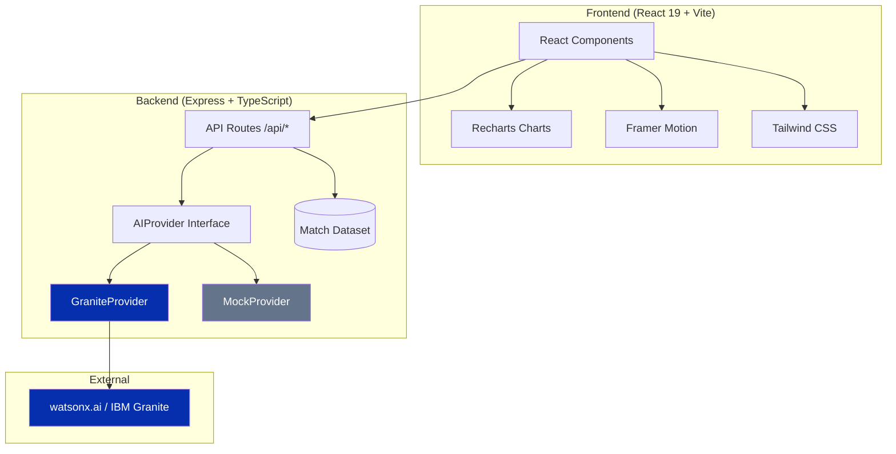

<div align="center">

# ⚽ GoalVision AI

### *Understand Football Like Never Before*

**AI-Powered Explainable Football Match Analysis**

[](https://skillsbuild.org)
[](https://www.typescriptlang.org)
[](https://react.dev)
[](https://tailwindcss.com)
[](https://www.ibm.com/granite)

</div>

---

## 📋 Table of Contents

- [Overview](#-overview)
- [Problem Statement](#-problem-statement)
- [Solution](#-solution)
- [Features](#-features)
- [Explainable AI](#-explainable-ai)
- [IBM Granite Integration](#-ibm-granite-integration)
- [Architecture](#-architecture)
- [Tech Stack](#-tech-stack)
- [Screenshots](#-screenshots)
- [Installation](#-installation)
- [Running Locally](#-running-locally)
- [Deployment](#-deployment)
- [Folder Structure](#-folder-structure)
- [Future Improvements](#-future-improvements)
- [License](#-license)

---

## 📖 Overview

GoalVision AI transforms raw football match data into **understanding**. Instead of overwhelming fans with numbers or delivering black-box predictions, it **explains the game in plain language** — every insight is grounded in real match data and fully transparent.

The application ships with **three legendary matches**: the 2022 World Cup Final, the Miracle of Istanbul (2005), and Liverpool 4–0 Barcelona (2019).

Built for the **IBM SkillsBuild AI Challenge**, GoalVision leverages **IBM Granite** on **watsonx.ai** for natural-language generation, with a seamless offline fallback so the demo never fails.

---

## 🎯 Problem Statement

Football analytics today suffers from two problems:

1. **Black-box predictions** — Fans are told *"Team A has a 72% win probability"* but never *why*. The model is opaque, the reasoning invisible.
2. **Information overload** — Raw stats (xG, possession, pass accuracy) are presented without context. Casual fans can't connect the numbers to what happened on the pitch.

**GoalVision AI solves both** by making every prediction explainable and every insight conversational — bridging the gap between data and understanding.

---

## 💡 Solution

| Problem | GoalVision Solution |
|---|---|
| Black-box AI | Every prediction shows exactly **which features** drive it and **by how much** — additive, inspectable, no hidden model |
| Raw stats without context | **Natural-language explanations** for every goal, card, offside and substitution |
| Static dashboards | **Conversational AI chat** grounded in match data — ask anything about the game |
| No tactical insight | **Tactical board** with formations, passing lanes, heat maps, and AI-generated tactical reads |
| Fragile demos | **Offline fallback** — works end-to-end without any external API |

---

## ✨ Features

| Feature | Description |
|---|---|
| **🧠 Explainable AI** | Click any goal, card, offside, penalty, or substitution → get an instant plain-language reason |
| **💬 Football Chat** | Ask "Why was this offside?", "Who changed the game?", "Compare both teams" — grounded in real match data |
| **📋 Tactical Board** | Interactive pitch with formations, passing lanes, heat maps, and AI-generated tactical reads per team |
| **📈 Win Probability** | Transparent, xG-based probability — the formula is shown, not hidden |
| **⏱️ Match Timeline** | Every key event beautifully visualised, clickable for AI explanation |
| **📝 AI Match Summary** | Broadcast-quality recap generated in seconds with confidence scoring |
| **🔍 Explainable AI Panel** | SHAP-style feature attribution showing exactly what drives each prediction |
| **🔄 Smart Fallback** | Seamless transition between IBM Granite and offline mock — zero errors |

---

## 🧠 Explainable AI

GoalVision's explainability is built on three principles:

### 1. Transparent Attribution (SHAP-style)

Every performance prediction is decomposed into **feature contributions**:

```
Expected Goals (xG)    +8.2 pts  ┃████████████████░░░░│
Goals Scored          +6.1 pts  ┃██████████░░░░░░░░░░│
Shots on Target       +4.5 pts  ┃███████░░░░░░░░░░░░░│
Possession            +1.2 pts  ┃██░░░░░░░░░░░░░░░░░░│
Pass Accuracy         +0.8 pts  ┃█░░░░░░░░░░░░░░░░░░░│
Discipline            -0.3 pts  ┃░│░░░░░░░░░░░░░░░░░░│
                              favours ▲     favours ▼
```

Each bar is a **fixed-weight, inspectable score** — no hidden model.

### 2. Counterfactual Reasoning

For every prediction, GoalVision explains **what would change it**:
> "Expected Goals (xG) is the swing factor (+8.2 pts to Argentina). Had France matched Argentina there, the 20.5-point edge would all but vanish."

### 3. Confidence Scoring

Every AI response includes a **confidence estimate** based on:
- Provider (IBM Granite vs Mock)
- Volume of match events
- Completeness of statistics
- Analysis type

---

## 🔷 IBM Granite Integration

GoalVision uses a clean **strategy pattern** for AI providers:

```
┌──────────────┐     ┌──────────────────┐
│  API Routes  │────▶│  AIProvider      │
│  /api/*      │     │  Interface       │
└──────────────┘     └────────┬─────────┘
                              │
                    ┌─────────┴─────────┐
                    ▼                   ▼
            ┌──────────────┐  ┌──────────────┐
            │  Granite     │  │  Mock        │
            │  Provider    │  │  Provider    │
            │  (watsonx)   │  │  (offline)   │
            └──────────────┘  └──────────────┘
```

### GraniteProvider
- Calls IBM Granite via the watsonx.ai REST API
- IAM token-based authentication with caching
- Greedy decoding with repetition penalty
- Automatic graceful degradation to Mock on failure
- Granite chat template formatting (`<|system|>`, `<|user|>`, `<|assistant|>`)

### MockProvider
- Fully offline, deterministic, no language model
- Composes analyst-style prose from grounded match facts
- Covers: offside, substitutions, penalties, cards, formations, comparisons, summaries, tactical reads

### Automatic Provider Selection
At startup, the factory checks for `WATSONX_API_KEY` + `WATSONX_PROJECT_ID`:
- **Present** → GraniteProvider (live)
- **Absent** → MockProvider (offline)

Switching is transparent — **the app never shows an error**.

---

## 🏗️ Architecture



### Data Flow

```
User Action → React Router → Page Component → API Client (network-first)
                                                     ↓
                                         ┌─── OK? ───┤
                                         │           │
                                         ▼           ▼
                                   Backend API    Local Fallback
                                   (Express)      (Bundled Data)
                                         │
                                         ▼
                                   AIProvider.generate()
                                         │
                                    ┌────┴────┐
                                    ▼         ▼
                                Granite     Mock
                               (watsonx)  (offline)
```

### Fallback Strategy

Every API call follows a **network-first, local-fallback** pattern:

| API Call | Network | Fallback |
|---|---|---|
| `listMatches()` | `GET /api/matches` | Bundled match cards |
| `getMatch(id)` | `GET /api/matches/:id` | Local match data |
| `aiStatus()` | `GET /api/ai-status` | `{ provider: "mock", live: false }` |
| `explain()` | `POST /api/explain` | `localExplain()` — keyword-driven |
| `chat()` | `POST /api/chat` | `localChat()` — keyword-driven |
| `summary()` | `POST /api/summary` | `localSummary()` — template-driven |
| `tactical()` | `POST /api/tactical` | `localTactical()` — template-driven |

---

## 🛠️ Tech Stack

### Frontend

| Technology | Version | Purpose |
|---|---|---|
| React | 19 | UI framework |
| TypeScript | 5.6 | Type safety |
| Vite | 6 | Build tool & dev server |
| Tailwind CSS | 3.4 | Utility-first styling |
| Framer Motion | 11 | Animations & transitions |
| Recharts | 2.15 | Interactive charts |
| React Router | 7 | Client-side routing |
| Lucide React | — | Icon library |
| class-variance-authority | — | Component variants |
| tailwind-merge | — | Class merging |

### Backend

| Technology | Version | Purpose |
|---|---|---|
| Node.js | 18+ | Runtime |
| Express | 4.19 | HTTP framework |
| TypeScript | 5.6 | Type safety |
| tsx | 4.19 | Dev server (watch mode) |
| IBM Granite | 3.0 | AI/LLM (via watsonx REST API) |

### DevOps

| Tool | Purpose |
|---|---|
| Render | Backend deployment |
| Vercel | Frontend deployment |
| GitHub | Version control |

---

## 📸 Screenshots

<div align="center">

| Landing | Dashboard | Match Analysis |
|---|---|---|
| *Animated hero with feature cards* | *Match card grid with AI insights* | *Timeline + stats + explainability* |

| Tactical Board | AI Chat | Match Summary |
|---|---|---|
| *Interactive pitch + formations* | *Grounded conversation* | *AI report + stats + performers* |

| Explainable AI Panel | Settings |
|---|---|
| *SHAP-style feature attribution* | *Provider status & session info* |

</div>

---

## 💻 Installation

### Prerequisites

- **Node.js 18+** (tested on Node 24)
- **npm** (comes with Node.js)
- **IBM Cloud account** (optional — for live Granite)

### Clone

```bash
git clone https://github.com/your-username/goalvision-ai.git
cd goalvision-ai
```

---

## 🚀 Running Locally

### 1. Backend

```bash
cd backend
npm install
cp .env.example .env        # Optional: add watsonx credentials
npm run dev                  # → http://localhost:4000
```

### 2. Frontend (separate terminal)

```bash
cd frontend
npm install
npm run dev                  # → http://localhost:5173
```

Open **http://localhost:5173**. The Vite dev server proxies `/api` to the backend.

> **No IBM credentials?** The app runs end-to-end in offline demo mode out of the box.

### Production Build

```bash
# Frontend
cd frontend
npm run build               # Outputs to frontend/dist/

# Backend
cd backend
npm start                   # Runs with tsx
```

---

## 🔑 Enabling IBM Granite (watsonx.ai)

Add these to `backend/.env`:

```env
WATSONX_API_KEY=your_ibm_cloud_api_key
WATSONX_PROJECT_ID=your_watsonx_project_id
WATSONX_URL=https://us-south.ml.cloud.ibm.com
WATSONX_MODEL_ID=ibm/granite-3-8b-instruct
```

Restart the backend — the console logs `IBM Granite enabled`. The app badge switches to **Powered by IBM Granite**.

---

## ☁️ Deployment

### Backend → Render

1. Push this repo to GitHub.
2. In Render: **New + → Blueprint**, select the repo. `render.yaml` configures everything.
3. Set `CORS_ORIGIN` to your Vercel URL.
4. (Optional) Set `WATSONX_API_KEY` and `WATSONX_PROJECT_ID` as secrets.

### Frontend → Vercel

1. In Vercel: **New Project**, import the repo.
2. Set **Root Directory** to `frontend`.
3. Add env var: `VITE_API_BASE_URL` = your Render backend URL (e.g., `https://goalvision-api.onrender.com`).
4. Deploy. `vercel.json` handles SPA routing.

---

## 📁 Folder Structure

```
goalvision-ai/
│
├── frontend/                      # React 19 SPA
│   ├── src/
│   │   ├── main.tsx               # App entry point
│   │   ├── App.tsx                # Route definitions + lazy loading
│   │   ├── index.css              # Tailwind + glassmorphism + animations
│   │   ├── types.ts               # Domain types
│   │   ├── context/
│   │   │   └── MatchContext.tsx    # Global state (matches, AI status)
│   │   ├── hooks/
│   │   │   └── useMatch.ts        # Single match fetch hook
│   │   ├── lib/
│   │   │   ├── api.ts             # API client with fallback
│   │   │   ├── predictions.ts     # Win probability + SHAP attribution + confidence
│   │   │   └── utils.ts           # cn(), formatDate(), event helpers
│   │   ├── data/
│   │   │   └── matches.ts         # 3 bundled historic matches
│   │   ├── pages/
│   │   │   ├── Landing.tsx        # Animated hero page
│   │   │   ├── Dashboard.tsx      # Match listing grid
│   │   │   ├── MatchAnalysis.tsx  # Timeline + stats + XAI
│   │   │   ├── TacticalBoard.tsx  # Pitch + momentum + AI reads
│   │   │   ├── AIChat.tsx         # Conversational AI
│   │   │   ├── MatchSummary.tsx   # AI match report
│   │   │   ├── Settings.tsx       # Provider status
│   │   │   └── NotFound.tsx       # 404 page
│   │   └── components/
│   │       ├── ai/AIResponse.tsx           # AI answer renderer + confidence
│   │       ├── explain/ExplainabilityPanel.tsx  # SHAP-style attribution
│   │       ├── football/Pitch.tsx          # SVG pitch + players + heat
│   │       ├── charts/                     # Recharts-based visualizations
│   │       ├── match/                      # Match shell, hero, tabs, timeline, drawer
│   │       ├── layout/                     # Navbar + footer
│   │       └── ui/                         # Button, Card, Badge, Spinner, States
│   ├── tailwind.config.ts
│   ├── vite.config.ts
│   ├── vercel.json
│   └── package.json
│
├── backend/                       # Express REST API
│   ├── src/
│   │   ├── index.ts               # Server entry point
│   │   ├── app.ts                 # Express app factory
│   │   ├── routes.ts              # All API route handlers
│   │   ├── types.ts               # Domain types
│   │   ├── data/
│   │   │   └── matches.ts         # 3 historic matches
│   │   └── ai/
│   │       ├── AIProvider.ts      # Abstract interface
│   │       ├── index.ts           # Factory (Granite vs Mock)
│   │       ├── GraniteProvider.ts # IBM watsonx.ai integration
│   │       ├── MockProvider.ts    # Offline fallback
│   │       ├── context.ts         # Factual match context builders
│   │       └── prompts.ts         # System/user prompt templates
│   ├── render.yaml                # Render blueprint
│   ├── tsconfig.json
│   └── package.json
│
├── package.json                   # Monorepo scripts
└── README.md
```

---

## 🔌 API Reference

| Method | Endpoint | Body | Purpose |
|---|---|---|---|
| `GET` | `/api/health` | — | Health check |
| `GET` | `/api/ai-status` | — | Active AI provider |
| `GET` | `/api/matches` | — | List match cards |
| `GET` | `/api/matches/:id` | — | Full match detail |
| `POST` | `/api/explain` | `{ matchId, eventId }` | Explain an event |
| `POST` | `/api/chat` | `{ matchId, message, history? }` | Grounded chat |
| `POST` | `/api/summary` | `{ matchId }` | AI match summary |
| `POST` | `/api/tactical` | `{ matchId, side }` | Tactical read |

---

## 🔮 Future Improvements

- [ ] **Live match data ingestion** — connect to real-time football APIs
- [ ] **Multi-language support** — explanations in Spanish, French, Arabic
- [ ] **Player comparison** — head-to-head performance breakdowns
- [ ] **Video integration** — link explanations to match highlights
- [ ] **Custom prompts** — user-configurable AI persona and depth
- [ ] **Granite 3.2** — upgrade to latest Granite model for enhanced reasoning
- [ ] **PDF export** — downloadable match reports
- [ ] **Dark/light mode** — theme toggle
- [ ] **Progressive Web App** — offline support via service workers
- [ ] **CI/CD pipeline** — automated testing and deployment

---

## 📄 License

This project is built for the **IBM SkillsBuild AI Challenge**. All rights reserved.

---

<div align="center">

**GoalVision AI** · *Understand Football Like Never Before*

Built with ❤️ for the IBM SkillsBuild AI Challenge

Powered by **IBM Granite** on **watsonx.ai**

</div>
